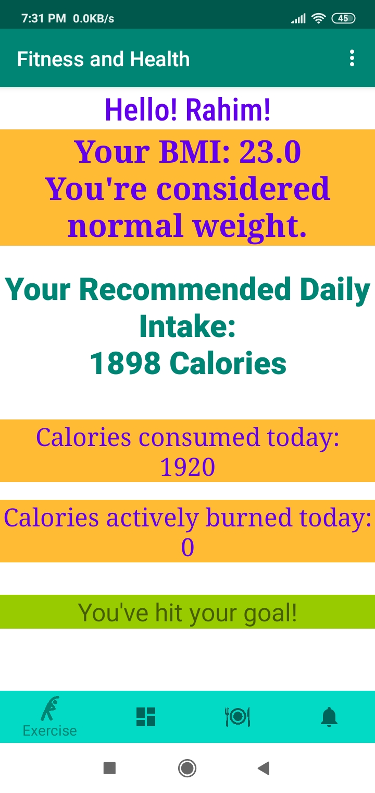
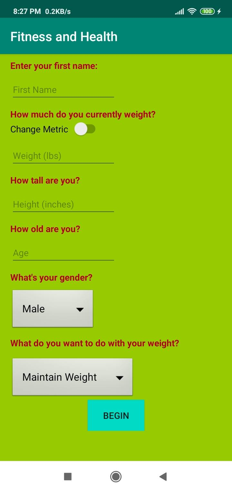

# Android-based-Health-and-fitness-
Fitness and Health Android app
this app calculates User's calories based on user's preferences and recommends some health tips.It also calculates burn calories based on some physical workout.

1.	Native android app developed using android studio
2.  It has a login form, and sign out and sign in features and also a bottom navigation to navigate to other pages.
3.	Architected using the youtube API,web API, shared preferences, Sqlite database and Google’s Firebase.
4.	Calculates user’s calorie based on data and gives daily calorie recommendation and burned calories based on workout.

